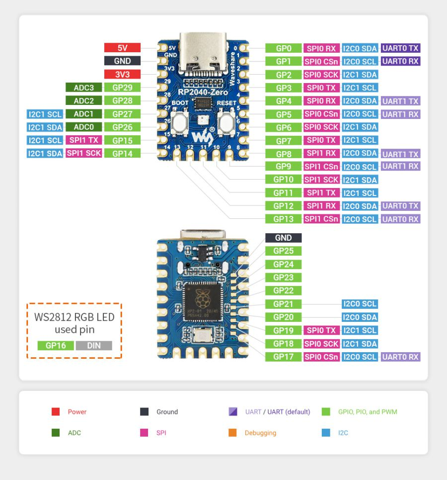

# LötBar 2025 Jubiläums Badge
Lustiger Badge mit IR Rx und Tx Funktion. Brain of Operation ist ein Mikrocontroller Modul
mit Micropyhton Unterstützung.

Die Schaltung befindet sich derzeit in der Planungsphase.

